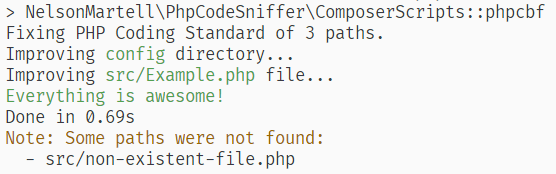

# PHP Code Sniffer Helpers


[](https://github.com/nelson6e65/php-code-sniffer-helpers/tags)
[](https://packagist.org/packages/nelson6e65/code-sniffer-helpers)
[](https://packagist.org/packages/nelson6e65/code-sniffer-helpers#dev-main)

[](LICENSE)
[](https://wakatime.com/badge/github/nelson6e65/php-code-sniffer-helpers)

Helpers for PHP Code Sniffer.

## Installation

```sh
composer require --dev nelson6e65/code-sniffer-helpers
```

## Features

### Composer scripts

#### `phpcbf` for lint-staged

A wrapper to fix your staged code (or argumented files/folders) using the **PHP Code Sniffer** auto-fixer.

There is a bug that does not allows you to use it directly as autofixer (https://github.com/squizlabs/PHP_CodeSniffer/issues/1818). There is [a workarround for using it as a composer script](https://github.com/squizlabs/PHP_CodeSniffer/issues/1818#issuecomment-735620637), but does not works for using it in a [lint-staged](https://github.com/okonet/lint-staged) pre-commit hook.

This helper is designed to be run with lint-staged, but you can also use it directly in your composer script.

##### Setup with lint-staged

Add the script to your composer.json:

```json
{
  "scripts": {
    "cs:fix-filtered": ["NelsonMartell\\PhpCodeSniffer\\ComposerScripts::phpcbf"]
  }
}
```

> I used `"cs:fix-filtered"` name, but you can use any script name you like.

Configure your Husky + lint-staged in your package.json

```json
{
  "husky": {
    "hooks": {
      "pre-commit": "lint-staged"
    }
  },
  "lint-staged": {
    "*.php": "composer cs:fix-filtered"
  }
}
```

> Example for Husky 4. Adapt it if you use Husky 5.

##### Usage

You can also run it directly with composer by using `composer cs:fix-filtered {PATHS}`. Example:

```sh
composer cs:fix-filtered src/ tests/ config/my-config-file.php
```

> Note: Non exixtent files/directories are ignored.

##### Output

The output is inspired on [pretty-quick](https://github.com/azz/pretty-quick) output:

```sh
composer cs:fix-filtered config/ src/Example.php src/non-existent-file.php
```



## License

[](LICENSE)

Copyright (c) 2021 Nelson Martell

Read the [`LICENSE` file](LICENSE) for details.
